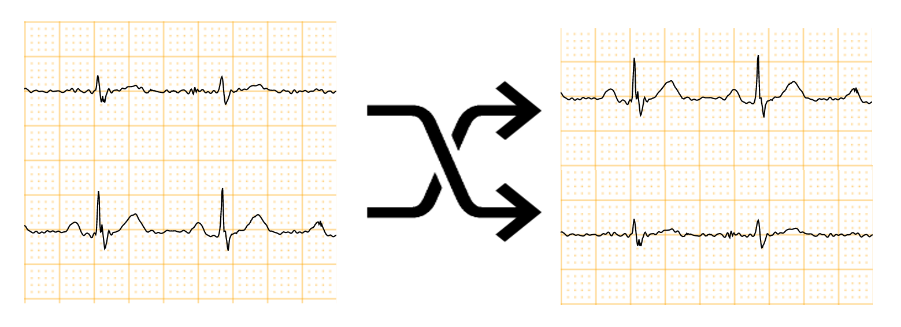

# Détection d'inversions d'électrodes dans un electrocardiogramme (ECG)

L'ECG est un signal temporel qui mesure l'activité électrique du coeur. C'est le principal outil pour diagnostiquer les maladies cardiovasculaires. L'enregistrement d'un ECG est très simple : 3 électrodes sont posées aux extrémités des membres, et 6 sur la face antérieure du thorax. Ceci permet de générer 12 séries temporelles.

La position des électrodes est très importante pour pouvoir correctement interpréter l'ECG. En effet, une erreur d'**inversion des électrodes** compromet l’interprétation, soit parce que les dérivations n’explorent plus exactement la région souhaitée (erreur dans les mesures d’indices d’hypertrophie, dans l’analyse du segment ST…), soit parce qu’elles génèrent de fausses anomalies (fausses ondes Q, erreur d’axe du cœur…).

Les erreurs d'inversion sont fréquentes (5 % des ECG), et seuls les experts (les cardiologues) arrivent à les détecter. Mais la plupart des ECG ne sont pas interprétés par des experts : seulement 30% le sont, le reste étant interprété par des infirmières, des pompiers ou des médecins généralistes. Un algorithme de détection automatique des inversions d'électrodes est donc indispensable pour un algorithme d'interprétation des ECGs et permettrait d'améliorer la qualité des diagnostics.

Ce projet va vous challenger sur la détection d'inversions d'électrodes dans un ECG. La base de données à votre disposition contient des ECG provenant d'un centre de cardiologie. Pour avoir plus de données positives, un certain nombre d'ECG correctement enregistrés ont été modifiés pour générer des ECG avec inversion. Un ECG sera étiqueté comme "correctement réalisé" ou comme présentant une des inversions d'électrodes parmis les plus fréquentes. Vous pourrez ainsi choisir de traiter le problème des inversions d'électrode comme un problème multiclasse ou directement comme "correctement réalisé" ou non.
